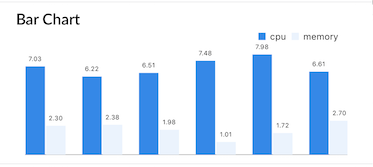

# MatrixOS Config Widget examples

# Layout

```
screens:
  - - digitTest
    - labelTest
  - - barChartTest
    - lineChartTest
  - - radarChartTest
    - gaugeTest
  - - listTest
```

# Displays

## Digit

```
digitTest:
  display: digit
  type: monitor
  key: cpu
  format: round
  label: cpu
```

## Label

```
labelTest:
  display: label
  type: uv
  key: risk
  label: UV Risk
```

## Bar Chart

```
barChartTest:
  display: bar
  type: monitor
  keys: cpu, memory
  label: Bar Chart
```

## Line Chart

```
lineChartTest:
  display: line
  type: monitor
  keys: cpu, memory
  label: Line Chart
```

## Radar Chart

```
radarTestTest:
  display: radar
  type: emotions
  keys: happy,sad,disgust,surprised,confused,calm,angry
  label: radarTest
```

## Gauge

```
gaugeTest:
  display: gauge
  type: face
  keys: views
  label: 'Views'
```

## Lists

```
listTest:
  type: device
  keys: Hostname,Type,Platform,Arch
  display: list
  label: Secret Information
```

# Interactive

## Input

### Single
```
control: input
event: testInput
value: 'type text'
```

###### Handling Data
```
matrix.on('testInput', function(p){
 var text = p.value;
})
```

## Buttons

### Single

```
buttonTest:
  label: Hacking Buttons
  control: button
  event: buttonInfo
  value: Get Secret Information
```
###### Handling Code
```
matrix.on('buttonInfo', function(){
  // ...
})
```
`event` in the config file, is the event name (`buttonInfo`) handled.


### Map Notation
Multiple events are supported in a widget through the use of the `map` property.

This has two valid expressions. Key / Value and Collection

#### Simple Form - Key, Value
```
buttons:
  control: button
  map:
    'label' : eventName
    'label2': event2Name
```


#### Simple Form - mapSort
Use `order` to display buttons in a particular order.

```
map:
  'label' : eventName
  'label2': event2Name
order:
  - 'label'
  - 'label2'
```

#### Normal Form - Multiple
```
buttons:
  control: button
  map:
   - value: seven
     event: event7
   - value: eight
     event: event8
   - value: nine
     event: event9
```

#### Normal Form Overview
```
map:
  - value: foo    # button label
    event: e     # event name emitted for app to listen for
    <!-- data: 1      # what data to send with this button -->
    <!-- color: 'red' # what color to tint this button -->
```

### Multiple

```
buttonsTest:
  label: Matrix Activation Buttons
  control: button
  map:
    'amps+': buttonUp
    'amps-': buttonDown
    begin : buttonStart
    end : buttonStop
    capture : buttonSample
    'refresh+' : buttonSlow
    'refresh-' : buttonFast
```
###### Handling Code
```
 matrix.on('buttonStop', function(){
   //...
})

 matrix.on('buttonStart', function(){
   //...
 })

 matrix.on('buttonSample', function () {
   //...
 })
```

## Switch

### Single
```
control: switch
event: switchChanged
value: 'Leds Enabled'
```

###### Handling Data
```
matrix.on('switchChanged', function(p){
 var isOn = p.value;
})
```

## Drop Downs

```
dropDown:
  control: dropdown
  map:
    test1: doTest1
    test2: doTest2
  label: dropdown test
```
Simple form and normal form from above also work for drop downs.

###### Handling Code
```
matrix.on('doTest1', function(){
 //...
})


matrix.on('doTest2', function(){
 //...
})
```

## Range
```
control: range
min: 0
max: 255
event: setRange
```

###### Handling Data
```
matrix.on('setRange', function(p){
 var value = p.value;
})
```

## XY

### Single
```
control: xy
event: xyChanging
xMax: 100
yMax: 50
```

###### Handling Data
```
matrix.on('xyChanging', function(p){
 var x = p.value.x;
 var y = p.value.y;
})
```

## Radial

### Single
```
control: radial
event: radialChanging
```

###### Handling Data
```
matrix.on('radialChanging', function(p){
 var x = p.value.x; //from -1 to 1
 var y = p.value.y; //from -1 to 1
})
```

# Responsive Data Flow
```
matrix.on('buttonInfo', function(){
  matrix.type('device').send({
    'os_hostname': os.hostname(),
    'os_type': os.type(),
    'os_platform': os.platform(),
    'os_arch': os.arch()
  });
})
```
When `buttonInfo` is triggered, respond with information with a type `device`.

The list looks for
```
widgets:
  list:
    type: device
```
The `list` widget displays information of type `device`.
