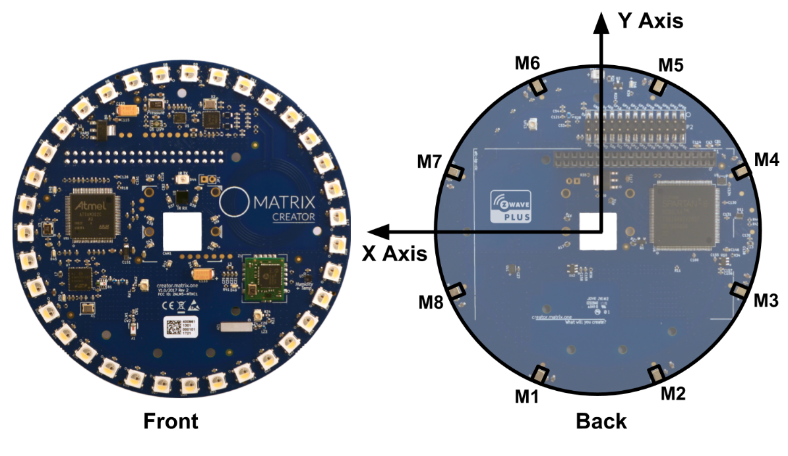

## Microphone Array on MATRIX Creator


## Usage
<h3 style="padding-top:0;">Driver installation</h3>
Follow the instructions below for allowing your MATRIX Creator to register as a microphone for your Raspberry Pi.
```language-bash
curl https://apt.matrix.one/doc/apt-key.gpg | sudo apt-key add -
echo "deb https://apt.matrix.one/raspbian $(lsb_release -sc) main" | sudo tee /etc/apt/sources.list.d/matrixlabs.list
sudo apt-get update
sudo apt-get upgrade
```
A reboot will be required after the MATRIX packages above are installed.
```language-bash
sudo reboot
```
The next commands will install the MATRIX kernel modules, overriding the stock Raspbian kernel.
```language-bash
sudo apt install matrixio-kernel-modules
```
A second reboot will be required.
```language-bash
sudo reboot
```
<h3 style="padding-top:0;">Check If Everything Works</h3>
Your Raspberry Pi should now treat your MATRIX Creator as a regular microphone. You can test this by using the following commands to record and play a 5 second long audio file on your Raspberry Pi.
> Be sure to have something connected to the Raspberry Pi's audio output.
```language-batch
arecord recording.wav -f S16_LE -r 16000 -d 5
aplay recording.wav
```

<h3 style="padding-top:0;">ALSA Configuration</h3>
The microphones can be grabbed using ALSA. Multiple libraries that support ALSA use these configurations to read microphone data with ALSA.

Device name - `hw:2,0`

Rates(Hz) - `8000` `12000` `16000` `22050` `24000` `32000` `44100` `48000` `96000`

Channels for each microphone - `1` `2` `3` `4` `5` `6` `7` `8`

## Audio Specifications

Sample Rate: 8 to 96 kHz

Bit Depth: Signed 16 bit

<h3 style="padding-top:0;">Position [x,y] of each mic in the array (mm)</h3>

| Mic  |      X      |      Y      |  
| ---- | ----------- | ----------- |  
|  M1  |  20.0908795 | -48.5036755 |
|  M2  | -20.0908795 | -48.5036755 |
|  M3  | -48.5036755 | -20.0908795 |
|  M4  | -48.5036755 |  20.0908795 |
|  M5  | -20.0908795 |  48.5036755 |
|  M6  |  20.0908795 |  48.5036755 |
|  M7  |  48.5036755 |  20.0908795 |
|  M8  |  48.5036755 | -20.0908795 |

<h3 style="padding-top:0;">Connection to the FPGA</h3>

You can check the physical connection between the FPGA and other components in 
<a href="https://github.com/matrix-io/matrix-creator-fpga/blob/master/creator_core/creator.ucf" target="_blank">creator.ucf</a>

| Mic  |   FPGA pin  |   PDM_Data  |  
| ---- | ----------- | ----------- |  
|  M1  |     P45     | pdm_data<0> |
|  M2  |     P46     | pdm_data<1> |
|  M3  |     P47     | pdm_data<2> |
|  M4  |     P58     | pdm_data<3> |
|  M5  |     P59     | pdm_data<4> |
|  M6  |     P64     | pdm_data<5> |
|  M7  |     P65     | pdm_data<6> |
|  M8  |     P44     | pdm_data<7> |
|  CLK |     P47     | pdm_clk     |