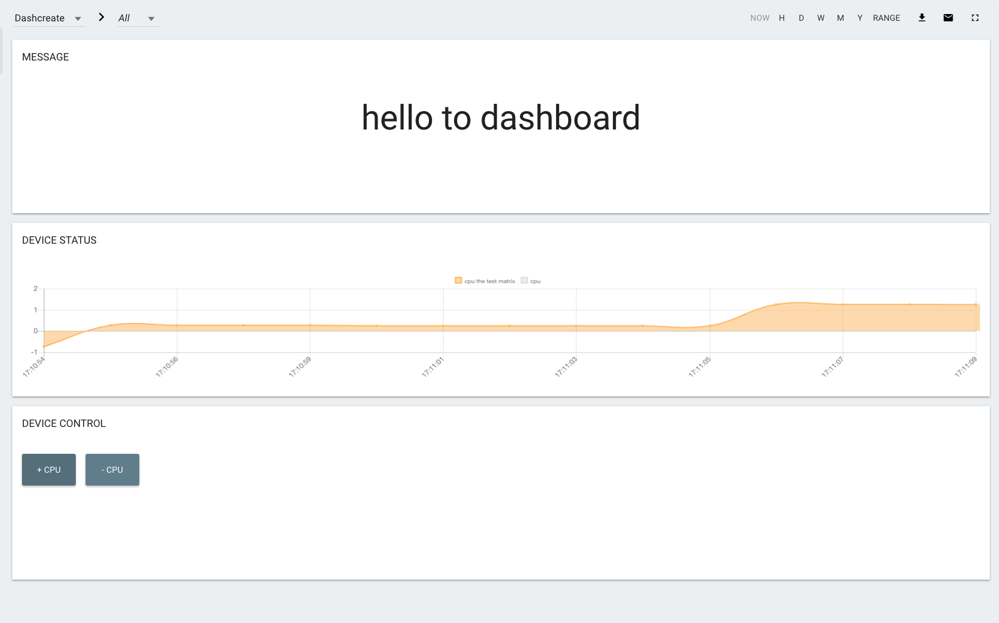

## Creating a Dashboard

In this example we will make this simple dashboard.



> Before attempting this example, you should have [CLI](../overview/cli.md) installed and are familiar with [application `create` and `deploy`](app-create.md) and [data types](../overview/data.md).

> For more details about what is covered in this example, please read about [widgets](../reference/widgets/) and [sensors](../reference/sensors/)

Dashboards serve two primary purposes:

1. Presenting data patterns over time.
1. Communicating with applications.

### Make application

```bash
$ matrix create ezDash
# enter details
$ cd ezDash
```

### Configure application

#### Send data

Data is sent and sorted via it's structure which is defined in `dataTypes`. In this example `motd` is the `type` of data which is parsed for a given key `msg` in the dashboard.

```yaml
dataTypes:
  motd:
    msg : string
```

#### Widget Definition

Define a widget named `message` that holds options defining which data to display.

```yaml
widgets: 
  message: 
    display: label
    type: motd
    key: msg
    label: from device
```

#### Add to layout

`message` is the widget name to add to the `screens` layout definition.
```yaml
screens:
  - message
```

#### Final Configuration File

```yaml
# config.yaml

dataTypes:
  motd:
    msg : string

widgets: 
  message: 
    display: label
    type: motd
    key: msg
    label: from device

screens:
  - message
```

### Application to send a Basic Message

Here, we use the dataType `motd`, and send an object with a `msg` key to display in the dashboard.
```js
# app.js
matrix.type('motd').send({msg: 'hello to dashboard'});
```

### Open the Dashboard

<http://dash.matrix.one>

### Starting the App

Dashboard display real time information. If you open an application, it will not show data until you either query historical information or a device application `send`s information.

### Charting Realtime Data

Adding a `display` widget and a `monitor` data type, the dashboard can begin to show information over time.

#### Configuration Additions

```yaml
# config.yaml
dataTypes:
  message: ...
  monitor: 
    cpu: float
    mem: integer

screens:
  - - motd
  - - graph

widgets:
  motd: ...
  graph:
    display: line
    type: monitor
    keys: cpu, mem
    label: Device Status
```

#### Code for chart widget

The following will send `cpu` and `mem` information to the `graph` widget to be charted.

```js
// app.js
const os = require('os');

setInterval(function(){
  matrix.type('monitor').send({ cpu: os.loadavg()[0], mem: os.freemem() })
}, 1000);
```

### Controls

Adding interactivity through `control` widgets is how end users can interface directly with devices in real time. 

```yaml
# config.yaml
screens:
  - - motd
  - - graph
  - - interface

widgets:
  motd: ...
  graph: ...
  interface:
    control: button
    event: increasePower
    value: + CPU
    label: Device Control
```

### More Controls

```yaml
# config.yaml
  interface:
    control: button
    map:  
      - event: increasePower
        value: + CPU
      - event: decreasePower
        value: - CPU
    label: Device Control
```
### Script For New Controls

```js
const os = require('os');

let cpuOffset = 0;
setInterval(function(){
  matrix.type('monitor').send({ cpu: os.loadavg()[0] + cpuOffset, mem: os.freemem() })
}, 1000);


matrix.on('increasePower', () => {
  cpuOffset++;
})

matrix.on('decreasePower', () => {
  cpuOffset--;
})
```

### Deploy & Start

Make sure your registered MATRIX device is on, connected, and you have selected the proper device with `matrix use`

```bash
# from /ezDash will upload code to device
> matrix deploy
> matrix start exDash

# subsequent deploys shouldn't need start, will automagically restart if deployed while active
> matrix deploy
