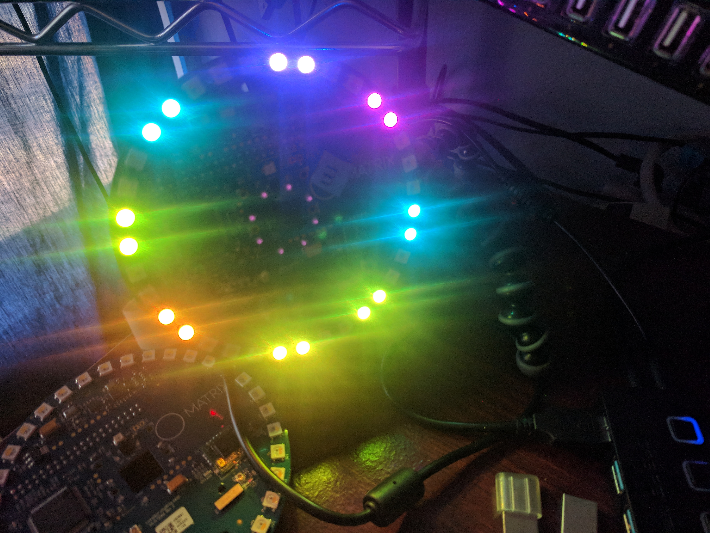

## Test your Sensors

> You need a registered MATRIX device with [CLI](../overview.md) installed

In [Hello World](../getting-started/hello-world), we installed an application which shines lights if a sensor is working properly

Here, we will build that application.

### Create New Application
First, create the application and visit the directory:

```
> matrix create mySensorTest
# app folder is made
> cd mySensorTest
```

### Edit Configuration
Edit `config.yaml` to add the sensors. This step is necessary to authorize the application to access the sensors.

```
sensors:
  - temperature
  - pressure
  - humidity
  - uv
  - altitude
  - gyroscope
  - magnetometer
  - accelerometer
```

### Edit Application
Edit `app.js`. This is an example of an implementation for one sensor, `temperature`. You will have to repeat the code for every sensor, and adjust the LED `angle` option accordingly.

```
matrix.sensor('temperature', function(data){
  matrix.led({
    angle: 0,
    color: 'blue'
  }).render();
});
```

Save your work.

### Deploy
After you have finished, return to the command prompt and `deploy`. You will have to select a device with `matrix use` before running this command.

```
# inside mySensorTest folder
> matrix deploy
```

In a moment, the application will be uploaded to your device. Now start your deployed application.

### Start

```
matrix start mySensorTest
```

