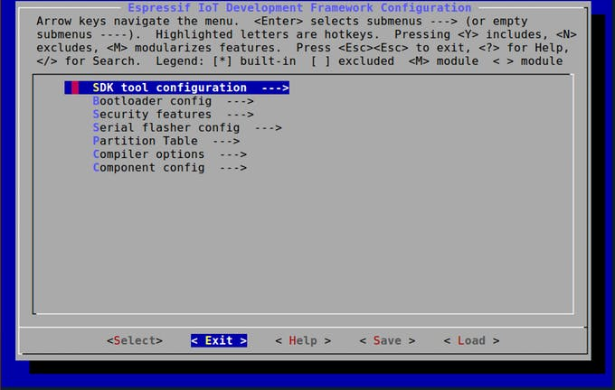
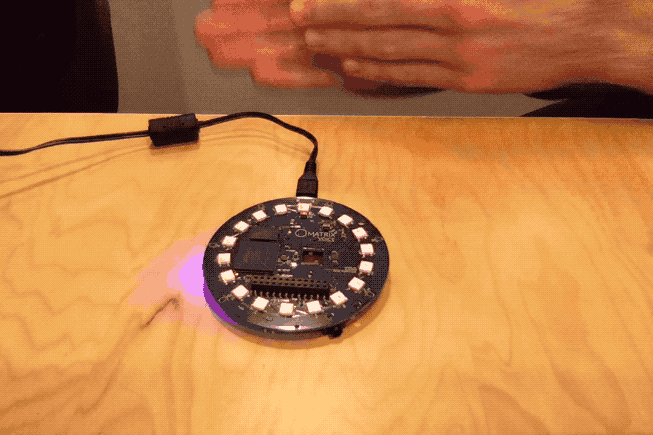

## ESP32 Setup
This guide will show you how to get started with the ESP32 module on the MATRIX Voice ESP32 version.

## Step 1: Raspberry Pi Setup

Run the following commands inside your Raspberry Pi terminal to install the MATRIX Voice Software. This will keep the FPGA firmware updated and install few tools to flash the ESP-WROOM-32.

```
# Add repo and key
curl https://apt.matrix.one/doc/apt-key.gpg | sudo apt-key add -
echo "deb https://apt.matrix.one/raspbian $(lsb_release -sc) main" | sudo tee /etc/apt/sources.list.d/matrixlabs.list
# Update packages and install
sudo apt-get update
sudo apt-get upgrade
# Installation
sudo apt install matrixio-creator-init
```
Reboot your Raspberry Pi to make sure all the required services are running.

## Step 2: Personal Computer Setup

Here we're installing the requirements needed to allow your pc to develop and compile ESP32 projects.

<b>Install Git:</b>

- <a href="https://git-scm.com/downloads" target="_blank">https://git-scm.com/downloads</a>

<b>Install ESP32 toolchain:</b>

- Linux: <a href="https://esp-idf.readthedocs.io/en/latest/get-started/linux-setup.html" target="_blank">https://esp-idf.readthedocs.io/en/latest/get-started/linux-setup.html</a>
- Mac: <a href="https://esp-idf.readthedocs.io/en/latest/get-started/macos-setup.html" target="_blank">https://esp-idf.readthedocs.io/en/latest/get-started/macos-setup.html</a>
- Windows: <a href="https://esp-idf.readthedocs.io/en/latest/get-started/windows-setup.html" target="_blank">https://esp-idf.readthedocs.io/en/latest/get-started/windows-setup.html</a>(currently not functioning)
- Stop Following when you reach "Next Steps"

<b>Setup ESP-IDF development framework:</b>

- Download ESP-IDF: <a href="https://esp-idf.readthedocs.io/en/latest/get-started/index.html#get-esp-idf" target="_blank">https://esp-idf.readthedocs.io/en/latest/get-started/index.html#get-esp-idf</a>
- Set ESP-IDF Path: <a href="https://esp-idf.readthedocs.io/en/latest/get-started/add-idf_path-to-profile.html" target="_blank">https://esp-idf.readthedocs.io/en/latest/get-started/add-idf_path-to-profile.html</a>

<b>Clone MATRIX Voice ESP32 repository</b>

This repository contains the necessary libraries to control the MATRIX Voice's components.
```
# windows must be using MINGw32 terminal from toolchain step
git clone https://github.com/matrix-io/matrixio_hal_esp32.git
```

## Step 3: Build and Deploy

Here we will be deploying and running one of the example apps in the Repository we just downloaded.

<b>Configuring IDF (one time setup):</b>
```
cd matrixio_hal_esp32/examples/mic_energy/
make menuconfig
```



You will now be taken to the IDF Configuration screen, as shown above. Once there, select the <Exit> option to save default configuration.

<b>Running example project:</b>

To finish running the example, all that's left is to make and deploy the code to the Raspberry Pi. This requires the Pi's IP address and you will be prompted to insert the Pi's password as well.
```
export RPI_HOST=pi@RASPBERRY_IP_ADDRESS
make deploy
```

<b>Step 4: Finishing Up</b>



Your MATRIX Voice ESP32 should now be running the deployed example. With the program properly flashed in the ESP32, the Voice can now run without the Pi if you choose to do so. Ensure the MATRIX Voice and Pi are not powered before connecting or disconnecting.


